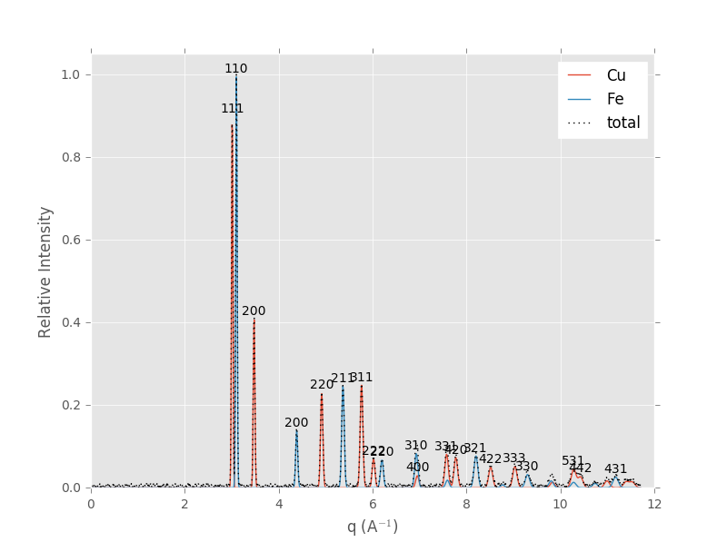

xrdpb: X-ray Diffraction (XRD) Pattern Builder
==============================================

What is xrdpb?
--------------

xrdpb is a utility to calculate and visualise powder diffraction profiles and the associated Debye-Scherrer rings in simple material systems. A detector (monochromatic area detector or energy dispersive detector array) and the experimental setup are defined before materials are 'added'. Multiple materials (or phases) can be introduced with a weight factor, which corresponds to the volume fraction of that material/phase.

A strain tensor can be defined and applied to the material(s). There is currently no option to apply a different strain state to each material/phase and no plan to implement this (until needed!).


Example Usage
-------------
```python
>> from xrdpb.detectors import MonoDetector
>> mono = MonoDetector(shape=(2000,2000), pixel_size=0.2, 
                       sample_detector=700, energy=100, 
                       energy_sigma=0.5)
```

```python
>> mono.intensity_factors('Fe', plot=True)
```

```python
>> mono.add_peaks('Fe', weight=0.8)
>> mono.add_peaks('Cu', weight=0.2)
>> mono.plot_intensity()
```

```python
>> mono.plot_rings(strain_tensor=(0.2, 0.2, 0.05)
```

Requirements
------------

xrdpb is built on Python’s scientific stack (numpy, scipy, matplotlib). Testing and development were carried out using the Anaconda scientific Python distribution (v 4.1), which built with the following packages:

-	Python: version 2.7.11 and 3.5.1
-	numpy: version 1.10.4
-	scipy: version 0.17
-	matplotlib: version 1.5

Compatability is expected with earlier versions of Python, numpy, scipy and matplotlib but this has not been tested.

Installation
------------

You can install xrdpb from source using the setup.py script. The source is stored in the GitHub repo, which can be browsed at:

https://github.com/casimp/xrdpb

Simply download and unpack, then navigate to the download directory and run the following from the command-line:

```
python setup.py install
```
